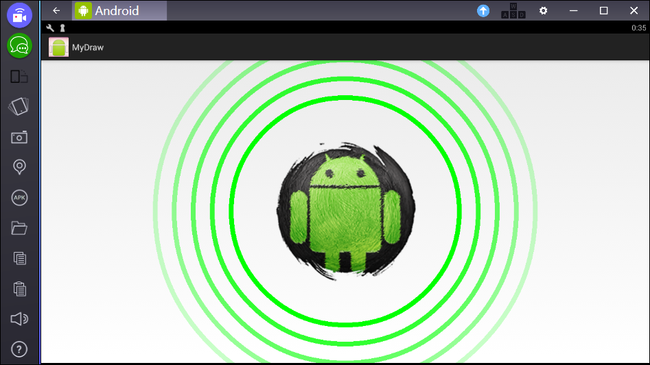

# MyDraw

Учебный Android-проект 

**Задания:**

* Добавить предсказания (`res/values/strings.xml` и функция `tap()` класса `MainActivity`)
* Добавить анимацию тряски шарика (подключить анимацию `shake.xml` из корня проекта к корневой разметке)
* Организовать закрытие приложения при повторном тапе
